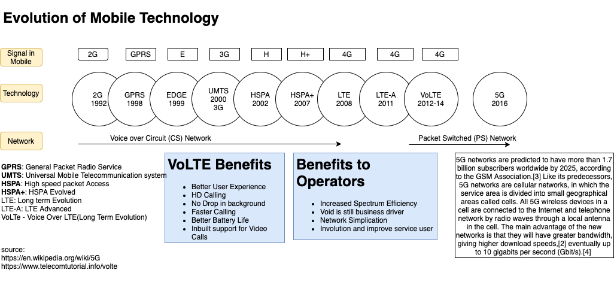
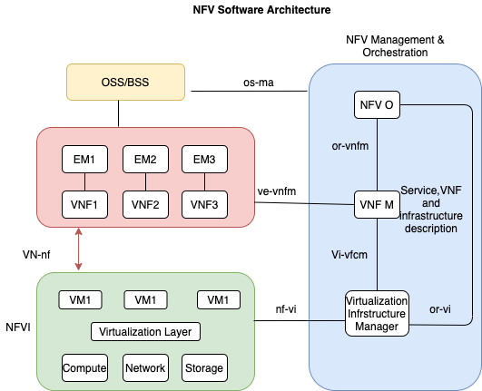
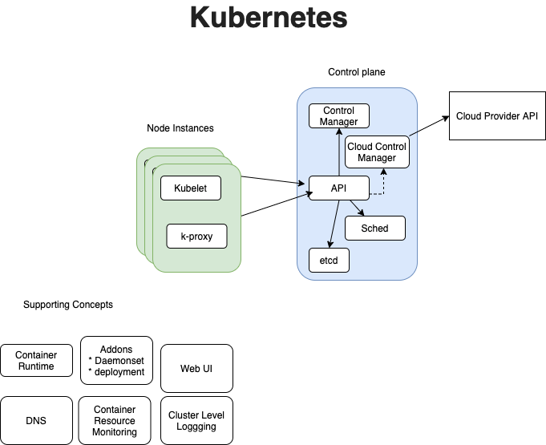

# Introduction

It is short notes on tele communications and cloud technologies. It is quick reference. You can look at references or sources for detailed information

## Telco-Cloud

Core concepts in 
* NFV (Network Functions Virtualisation)
* SDN(Software Defined Networking) - OpenFLow
* Containers and Virtualisation

Benefits of Telco-Cloud

* No dedicated setup
* Shared resources
* Convenient access from anywhere 
* Rapid Expansions & Elasticity
* On Demand Access
* Offered as Networks,Severs, storage and App and Services

## NFV Architecture

* **VNF(Virtual Network Function**: Virtualization of network element. examples firewalls,IPS,GGSN,SGSN,RNC,EPC
* **EM (Element Management)**:  to manage **FCAPS** functional part of VNF
* **VNF Manager**: to mange life cycle management of different VNF Instances.It covers **FCAPS** - Fault, Configuration, Accounting, Performance, Security for **virtual part** of VNF
    differents with VNF Manager and EM: EM is taking of functional level and VNFM is taking care of virtualization level. 
* **NFVI(Network Function virutalization Infrastrure)** that hosts different VNF It includes different physical resources,virtualation layer
* **VIM (Virtualized Infrastructure Manager)** To create,manage compute,network and storag requirements for one or more VNFs. (It is single cluster in Kubernetes).
* **NFV Orchestrator**  to create and maintain different VNFs. (it consider as different clusters in Kubernetes)
* **OSS** deals network, fault management, configuration and service management
* **BSS** deals with customer, productand order managements

In the NFV architecture, the current BSS/OSS of an operator may be integrated with the NFV Management and Orchestration using standard interfaces.

## Kubernetes

### Control Plane Components 

* **kube-apiserver** The API server is a component of the Kubernetes control plane that exposes the Kubernetes API
* **etcd** Consistent and highly-available key value store used as Kubernetes' backing store for all cluster data.
* **kube-scheduler** Control plane component that watches for newly created Pods with no assigned node, and selects a node for them to run on.Factors taken into account for scheduling decisions include: individual and collective resource requirements, hardware/software/policy constraints, affinity and anti-affinity specifications, data locality, inter-workload interference, and deadlines.
* **kube-controller-manager** 
Control Plane component that runs controller processes.
Node controller: Responsible for noticing and responding when nodes go down.
* `Job controller:` Watches for Job objects that represent one-off tasks, then creates Pods to run those tasks to completion.
* `Endpoints controller:` Populates the Endpoints object (that is, joins Services & Pods).
* `Service Account & Token controllers:` Create default accounts and API access tokens for new namespaces.
* **cloud-controller-manager** The cloud-controller-manager only runs controllers that are specific to your cloud provider. If you are running Kubernetes on your own premises, or in a learning environment inside your own PC, the cluster does not have a cloud controller manager.

The following controllers can have cloud provider dependencies:
* Node controller: For checking the cloud provider to determine if a node has been deleted in the cloud after it stops responding
* Route controller: For setting up routes in the underlying cloud infrastructure
* Service controller: For creating, updating and deleting cloud provider load balancers

### Node Components

*  **`kubelet`** An agent that runs on each node in the cluster. It makes sure that containers are running in a Pod.
* **`kube-proxy`** kube-proxy is a network proxy that runs on each node in your cluster, implementing part of the Kubernetes Service concep

## Technical consideration in Kubernets for NFV

How to implement NFV in Kubernet

1. Optimize Host and Hardware
2. Create Contains for For VNF with Multiple NIC Support
3. Deploy necessary Deployment manifest into Kubernet 

Some of technical references 

• CPU Manager ( https://kubernetes.io/docs/tasks/administer-cluster/cpu-management-policies/)
• Huge Pages
• Topology Manager (https://kubernetes.io/docs/tasks/administer-cluster/topology-manager/)
• Multus CNI (https://github.com/k8snetworkplumbingwg/multus-cni)
• SRIOV CNI (https://github.com/k8snetworkplumbingwg/sriov-network-device-plugin)
• SRIOV Network device plugin for SRIOV/DPDK

Support Notes: 
* https://events19.linuxfoundation.org/wp-content/uploads/2018/07/ONS2019_Cloud_Native_NFV.pdf
* Deploying Container Network Functions (CNF) on Kubernetes https://www.youtube.com/watch?v=-0M5wZrC-TA

Referernc
## Abbreviations
* **ADC** - Application Detection and Control 
* **API** - Application Programming Interface 
* **AppVM** - Application Virtual Machines 
* **ATM** - Asynchronous Transfer Mode 
* **BFCP** - Binary Floor Control Protocol 
* **BGP** - Border Gateway Protocol
* **BGP-LS** - Border Gateway Protocol - Link State BRAS Broadband Remote Access Server CDN Content Delivery Network
* **COTS** - Commercial off the Shelf
* **CPU** - Central Processing Unit
* **CSCF** - Call Session Control Function
* **DB** - DataBase
* **DDoS** - Distributed Denial of Service
* **DHCP** - Dynamic Host Configuration Protocol
* **DNS** - Domain Nane Server
* **DPDK** - Data Plane Development Kit
* **DPI** - Deep Packet Inspection
* **DRA** - Diameter Routing Agent
* **DSCP** - Differentiated Services Code Point
* **DSP** - Digital Signal Processor
* **DSR** - Direct Server Return
* **ELAN** - Ethernet Virtual Private LAN
* **EM** - Element Management
* **EPC** - Evolved Packet Core
* **ETH** - Ethernet
* **eTOM** - enhanced Telecom Operations Map
* **EVPN** - Ethernet VPN
* **FAB** - Fulfilment, Assurance, Billing
* **FCAPS** - Fault, Configuration, Accounting, Performance, Security 
* **FORCES** - FOrwarding and Control Element Separation
* **FRR** - Fast ReRoute
* **GGSN** - Gateway GPRS Service Node
* **GTP** - GPRS Tunnel Protocol
* **GW** - Gateway
* **HDW** - Hardware
* **HTTP** - Hypertext Transfer Portocol
* **HW** - Hardware
* **I** -2SR Interface 2 the Routing System
* **IB** - Infiniband
* **IDPS** - Intrusion Detection And Prevention Systems IGMP Internet Group Management Protocol
* **IGP** - Internet Gateway Protocol
* **IMS** - IP Multimedia Subsystem
* **IO** - Input Output
* **IP** - Internet Protocol
* **IPS** - Intrusion Prevention System
* **ISA** - Industry Standard Architecture
* **ISO** - International Organisation for Standardization
* **IT** - Information Technology
* **LAG** - Link Aggregation Groups
* **LAN** - Local Area Network
* **LB** - Load Balancer
* **LISP** - Location Identifier Separation Protocol
* **LSP** - Label Switched Paths
* **MAC** - Media Access Control
* **MEF** - Metro Ethernet Forum
* **MME** - Mobility Management Entity
* **MPLS** - Multiprotocol Label Switching
* **MRB** - Media Resource Broker
* **MRF** - Media Resource Function
* **MRF-C** - Multimedia Resource Function Controller
* **MRF-P** - Multimedia Resource Function Processor
* **MSRP** - Message Session Relay Protocol
* **NAT** - Network Address Translation
* **NF** - Network Function
* **NFV** - Network Function Virtualisation
* **NFVI** - NFV Infrastructure
* **NFVO** - Network Functions Virtualisation Orchestrator
* **NIC** - Network Interface Controller
* **NVFI** - Network Functions Virtualisation Infrastructure
* **NVGRE** - Network Virtualisation using Generic Routing Encapsulation 
* **OAM** Operations, Administration and Maintenance/Management OCS Online Charging Function
* **OF** - OpenFlow
* **OFCS** - Offline Charging Function
* **OFLS** - OpenFlow Logical Switch
* **ONF** - Open Networking Foundation
* **OS** - Operating System
* **OSS** - Operations Support System
* **PCC** - Policy and Charging Control
* **PCEF** - Policy and Charging Enforcement Function
* **PCRF** - Policy and Charging Rules Function
* **PGW** - Packet Data Network Gateway
* **PMIP** - Proxy Mobile IP
* **PNF** - Physical Network Function
* **RAM** - Random Access Memory
* **RDBMS** - Relational Data Base Management System
* **REQ** - Requirement
* **RFC** - Request For Comment
* **RLOC** - Routing Locator
* **RTCP** - Real-time Transport Control Protocol
* **RTP** - Real-time Transport Protocol
* **SCSI** - Small Computer System Interface
* **SDK** - Software Development Kit
* **SDN** - Software Defined Networks
* **SIP** - Session Initiation Protocol
* **SLA** - Service Level Agreement
* **SNMP** - Signalling Network Management Protocol
* **SSL** - Secure Socket Layer
* **SWA** - Software Architecture
* **TCP** - Transfer Control Protocol
* **TDF** - Traffic Detection Function
* **TDF-C** - Traffic Detection Function - Control 
* **TDF-LB** Traffic Detection Function - Load Balancer 
* **TDF-P** Traffic Detection Function - Processing
* **TE** - Traffic Engineering
* **TMN** - Telecommunications Management Network UDP Unreliable Datagram Protocol
* **VDC** - Virtual Data Centre
* **VIM** - Virtualised Infrastructure Manager
* **VLAN** - Virtual Local Area Network
* **VM** - Virtual Machine
* **VNF** - Virtualised Network Function
* **VNFC** - Virtualised Network Function Component
* **VNFD** - Virtualised Network Function Descriptor
* **VNFFG** - VNF Forwarding Graph
* **VNFM** - Virtualised Network Function Manager 
* **VNF-NCT** VNF Network Connectivity Topology
* **vNIC** - VoLTE VPLS VxLAN WAF WAN

## References

* https://telcocloudbridge.com/blog/a-cheat-sheet-for-understanding-nfv-architecture/
* NFV Specification https://www.etsi.org/deliver/etsi_gs/nfv-swa/001_099/001/01.01.01_60/gs_nfv-swa001v010101p.pdf
* https://www.telecomtutorial.info/
* https://kubernetes.io/docs/concepts/overview/components/
* Build Your Own Private 5G Network on Kubernetes - Frank Zdarsky, Red Hat & Raymond Knopp, Eurecom https://www.youtube.com/watch?v=R_JOhWlwsXo
* OVN for NFV workloads with Kubernetes https://www.youtube.com/watch?v=pD9dkPDr_jU
* Deploying Container Network Functions (CNF) on Kubernetes https://www.youtube.com/watch?v=-0M5wZrC-TA